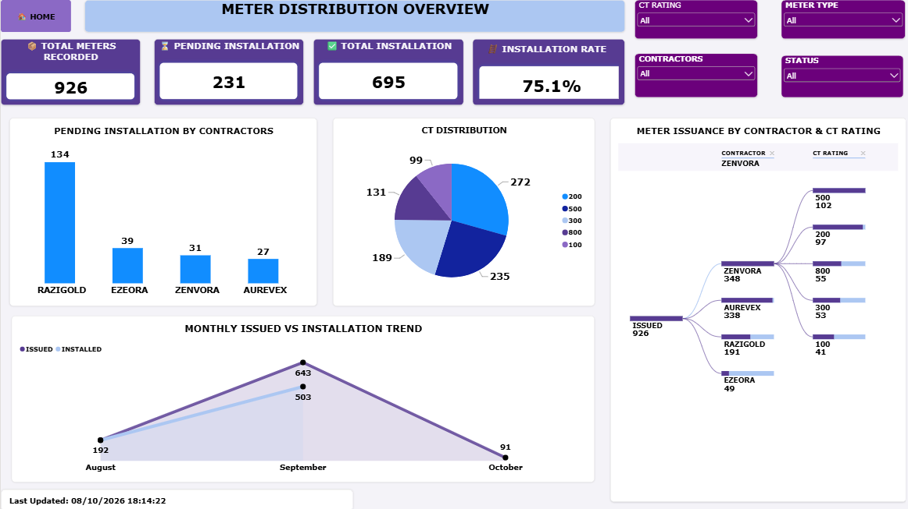

# Meter Distribution & Capture Analysis

## Project Overview
This project analyzes meter distribution, issuance and capture performance using data analytics and business intelligence tools.
The project was developed to provide visibility into operational performance, identify outstanding meters and support data-driven decision-making.

## Business Problem
Management requires a clear and reliable view of meter distribution and capture activities in order to monitor progress, identify outstanding records and improve operational efficiency.

## Project Objectives
- Monitor total meters received
- Track meters issued
- Track captured meters
- Identify pending meters
 - Measure capture rate
 - Analyze performance over time
- Identify data quality issues
-  Provide actionable recommendations

## Tools Used
- Microsoft Excel
- Power Query
 -Power BI
- DAX
- Data Cleaning
- Data Visualization
 -Business Analysis

## Data Preparation
The data was cleaned and transformed before analysis.
Key activities included:
- Removing duplicate records
- Standardizing meter numbers
- Cleaning inconsistent status values
- Handling missing values
- Standardizing dates
- Validating data types
- Creating calculated measures

## Dashboard
The Power BI dashboard provides an interactive view of:
 - Total meters
 - Issued meters
 - Captured meters
 - Pending meters
-  Capture rate
- Monthly performance
 - Meter categories
 - Operational performance

## Key Insights
Analysis of the meter distribution and installation dataset revealed the following:
- 926 meters recorded: The project dataset contains 926 meters tracked for distribution and installation.
- 75.1% installation rate: A total of 695 meters have been installed, Representing 75.1% of the recorded meters.
- 231 installations pending: Approximately 24.9% of the recorded meters remain pending installation, Highlighting the need for continued operational monitoring.
- Installation Progress visibility: Contractor level and monthly trend visualizations support the monitoring of installation activities and identification of outstanding work.
  These findings provide an operational overview of installation progress and help prioritize follow-up activities.

## Recommendations
Based on the analysis, The following actions are recommended: 
- Prioritize pending installations: Track the 231 outstanding installations and assign clear follow-up responsibilities.
- Monitor installation progress: Review monthly installation trends to identify delays and take timely corrective action.
- Review contractor performance: Use contractor level reporting to identify outstanding work and focus operational support where needed.
- Maintain accurate records: Regularly reconcile recorded meters, completed installations, and pending installation to ensure reliable reporting.
- Track performance over time: Monitor installation rate and pending workload regularly to measure progress toward competion.

## Skills Demonstrated
-  Data Cleaning
-  Data Transformation
-   Data Modeling
-    DAX
-   Power BI
-  Excel
-   Data Visualization
-    Business Analysis

## Dashboard Preview

